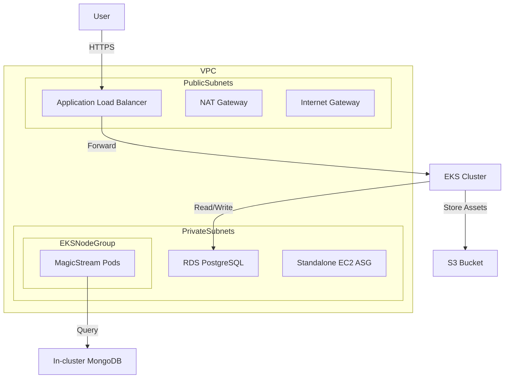

# Infrastructure Architecture

## Overview
This infrastructure is designed for a cloud-native, production-ready environment on AWS. It uses a modular Terraform approach to manage resources across multiple environments (`dev`, `staging`, `prod`).

## Architecture Diagram (Mermaid)

## Components
1. **VPC**: Multi-AZ setup with public and private subnets. NAT Gateway for private outbound traffic.
2. **EKS Cluster**: Managed Kubernetes control plane (v1.35).
3. **Managed Node Groups**: Scalable worker nodes in private subnets.
4. **RDS PostgreSQL**: Encrypted relational database for high-integrity data.
5. **S3 Bucket**: Scalable storage for static movie assets and metadata.
6. **Auto Scaling Group**: Standalone EC2 instances for auxiliary management tasks.
7. **Security Groups**: Least-privilege rules restricting access between components.

## Security Controls
- **Encryption at Rest**: AWS KMS/AES-256 for RDS, EBS, and S3.
- **Encryption in Transit**: TLS 1.3 for all external communication.
- **RBAC**: Kubernetes RBAC with EKS Pod Identity for AWS credential management.
- **Network Isolation**: Applications run exclusively in private subnets.
